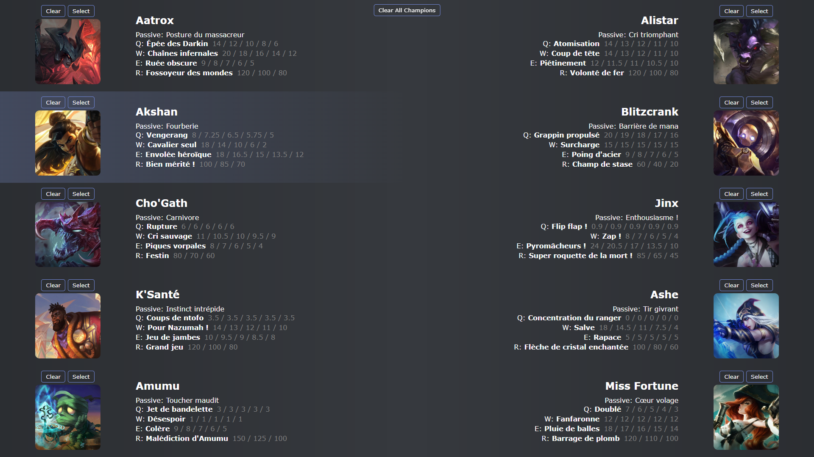

# LOL Champion Infos Display 🏆

Welcome to the **LOL Champion Infos Display** project! This application provides detailed information about League of Legends champions.
It's built using Node.js.



## Features ✨

- Display detailed information about 10 champions to use during drafts.
- Search for champions by name.
- User-friendly interface.

## Prerequisites 📋

Before you begin, ensure you have met the following requirements:

- You have installed [Node.js](https://nodejs.org/) (version 22 or latest stable).
- You have installed [Git](https://git-scm.com/) (optional).

## Installation 🛠️

Follow these steps to install and set up the project:

### Using GIT
1. **Clone the repository:**

    ```bash
    git clone https://github.com/your-username/lol-champion-infos-display.git
    ```

2. **Navigate to the project directory:**

    ```bash
    cd lol-champion-infos-display
    ```

3. **Install the dependencies:**

    ```bash
    npm install
    ```

### Without GIT

1. Go the releases page and download the latest version zip https://github.com/ImSpyke/lol-champion-infos-display/releases
2. Extract in your choosen directory
3. Navigate to this directory
4. Run `npm_install.batch` or `npm_install.sh` depending on your operating system

## Usage 🚀

To start the application, run the following command:

```bash
npm start
```

### Using start script

Alternatively, you can use the provided start script:
- For **Windows:**, run `./start.bat`
- For **Linux/Mac:**, run `./start.bat`

After running the script, open your browser and navigate to `http://localhost:3000` to see the application in action.

(If this isnt working, you may try `http://127.0.0.1:3000`)

## License 📄

This project is licensed under the MIT License. See the [LICENSE](LICENSE.mp3) file for details.

## Contact 📧

If you have any questions or suggestions, feel free to open an issue or contact me at [your-email@example.com].

Happy coding! 🎉